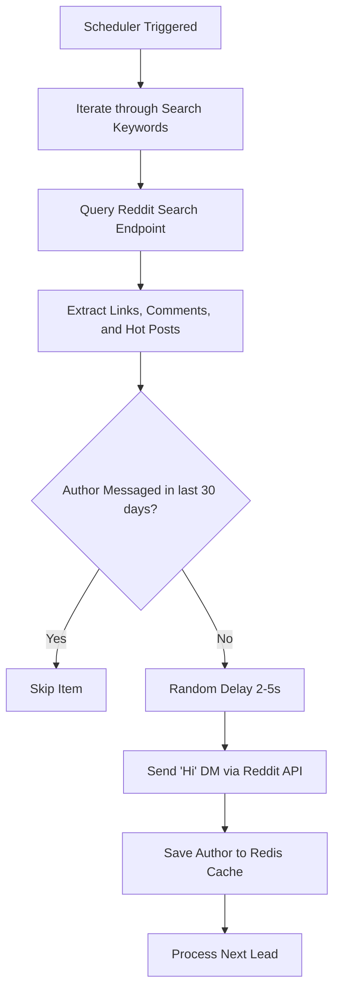

# Reddit Outreach Lead Bot 🚀

This bot automatically monitors Reddit every 2 hours to discover prospective clients who need web development services. It searches posts and comments for high-intent keywords, ensures you never double-message anyone using a 30-day Redis cache, and reaches out to them by initiating a Direct Message with "Hi".

---

## ⚙️ How the Bot Works

Every **2 hours**, the Devvit scheduler triggers an automated task mapping to the `/internal/scheduler/check-gigs` endpoint.



---

## 🛠️ Step-by-Step Playbook: Running & Verifying the Bot

You don't have to write a guide from scratch—here is the workflow to run, test, and verify that the bot functions exactly as expected.

### 1. Preparation: Authenticate

If you haven't already authenticated your terminal with Devvit, run:

```bash
npm run login
```

Follow the browser prompts to authorize the CLI.

---

### 2. Instant Verification (Reddit Mod Menu)

Since `devvit playtest` deploys your code directly to Reddit's hosted environment (and not a local port), you cannot test it using `localhost` or `curl`.

Instead, I've added a custom **Moderator Subreddit Menu Action** so you can trigger the bot directly from the Reddit UI!

1. **Start Playtest Session**:
   Ensure `npm run dev` is running (it deploys the latest version to your playtest subreddit `r/outreach_bot_dev`).

2. **Trigger the Bot Manually**:
   - Open the playtest URL in your browser: `https://www.reddit.com/r/outreach_bot_dev/?playtest=outreach-bot`
   - Open the **moderator utilities/menu** of the subreddit (or look at the subreddit's community options / mod tools menu). You will see a new action: **"Trigger Gig Check"**.
   - Click **Trigger Gig Check**.

3. **Check the Output**:
   - In your browser, a Reddit toast notification will pop up: `🚀 Gig check completed successfully!`
   - In your playtest terminal, you will instantly see the outreach logs:
     ```text
     🚀 Running gig check at 2026-05-18T00:45:00.000Z
     ✅ Sent "Hi" to [username] for post: "need web developer..."
     ✅ Gig check completed
     ```

---

### 3. Deploying to a Live Private Subreddit

Once local validation succeeds, deploy it to a private sandbox subreddit on Reddit's live servers to monitor real-world scheduling:

1. **Create a Private Subreddit**:
   Go to Reddit, select **Create Community**, call it `mygigbotprivate` (or a name of your choice), and set it to **Private** for safety.

2. **Upload your Bot**:

   ```bash
   npm run deploy
   ```

   _This compiles the TypeScript code, validates types, and uploads the bundle safely to Reddit's Devvit platform._

3. **Install the Bot**:
   Install the uploaded application on your private moderator sandbox:

   ```bash
   npx devvit install r/mygigbotprivate
   ```

4. **Verify Logs in Real Time**:
   Keep an eye on active logs to confirm successful periodic executions:
   ```bash
   npx devvit logs r/mygigbotprivate
   ```

---

## 🔍 How to Confirm It's Working Correctly

- **Duplicate Prevention**: Trigger the endpoint twice in a row. The second run should immediately skip all leads processed during the first run because they are now cached in Redis for 30 days.
- **Sent Messages**: Log into your Reddit bot account and check the **Sent Direct Messages** tab. You should see "Hi" messages sent out to target authors.
- **Random Delay**: You should notice a 2 to 5-second staggered pause between messages in your execution logs, keeping the bot safe from Reddit's automated rate limits.

---

> [!WARNING]  
> **Direct Message Limits**: Reddit enforces strict system-wide caps on outbound DMs from new accounts to curb spam. It is highly recommended to run this bot from a Reddit account with existing history/karma and to keep query limits reasonable to avoid account suspensions.
# reddit-outreach-bot
